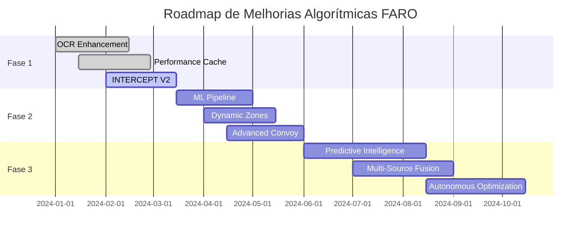

# 📊 Análise Abrangente de Algoritmos FARO
## Levantamento Profundo de Características, Integrações e Oportunidades

---

## 🎯 **Visão Geral do Ecossistema Algorítmico**

O sistema FARO implementa **7 algoritmos principais** de inteligência que operam em sequência para cada observação de veículo, criando uma rede de detecção multicamadas:

```
Observação → Watchlist → Impossible Travel → Route Anomaly → Sensitive Zone → Convoy → Roaming → INTERCEPT
```

---

## 🔍 **Análise Detalhada por Algoritmo**

### 1. 🔴 **WATCHLIST** - *Identificação de Alvos Conhecidos*

#### **Características Atuais**
```python
async def evaluate_watchlist(db, observation):
    # Busca exata e parcial (4 primeiros caracteres)
    # Prioridade: exata > parcial
    # Decisões: CRITICAL_MATCH > RELEVANT_MATCH > WEAK_MATCH
    # Confiança: 95% (exata) > 62% (parcial)
```

#### **Mecanismo de Funcionamento**
- **Matching**: Placa exata OU parcial (4 primeiros dígitos)
- **Priorização**: Por nível de prioridade da watchlist (1-20 = crítico)
- **Confiança**: Baseada em tipo de match e prioridade
- **Severity**: critical > high > moderate

#### **Pontos Fortes**
- ✅ Alta precisão para matches exatos
- ✅ Flexibilidade com matches parciais
- ✅ Priorização automática por gravidade
- ✅ Sistema de eventos em tempo real

#### **Limitações Atuais**
- ❌ Apenas matching textual, sem semântica
- ❌ Sem validação de formato de placa
- ❌ Sem correlação com histórico do veículo
- ❌ Sem aprendizado de falsos positivos

#### **🚀 Oportunidades de Melhoria**
```python
# 1. Enhanced Matching Semântico
- Levenshtein distance para similaridade
- Normalização de caracteres especiais
- Validação de formato por estado
- OCR correction suggestions

# 2. Inteligência Contextual
- Correlação com histórico de observações
- Padrões de horário/locação
- Análise de co-ocorrência com outras placas
- Machine learning para priorização dinâmica

# 3. Integração OCR/LPR
- Sugestões de correção baseadas em OCR
- Confiança baseada em qualidade da imagem
- Cross-validação com múltiplas leituras
- Feedback loop de validação humana
```

---

### 2. ⚡ **IMPOSSIBLE TRAVEL** - *Detecção de Clonagem/Teletransporte*

#### **Características Atuais**
```python
async def evaluate_impossible_travel(db, observation):
    # Janela: 6 horas de histórico
    # Velocidade máxima: 80 km/h
    # Decisões: IMPOSSIBLE > HIGHLY_IMPROBABLE > ANOMALOUS
    # Confiança: 95% > 87% > 73% > 51%
```

#### **Mecanismo de Funcionamento**
- **Janela Temporal**: Últimas 6 horas
- **Velocidade de Referência**: 80 km/h (conservadora)
- **Análise Multi-Agência**: Detecção de clonagem entre jurisdições
- **Thresholds Adaptativos**: 50%, 80%, 120% do tempo plausível

#### **Pontos Fortes**
- ✅ Detecção robusta de clonagem multi-agência
- ✅ Thresholds bem calibrados
- ✅ Métricas detalhadas (distância, tempo, velocidade)
- ✅ Explicações claras para operadores

#### **Limitações Atuais**
- ❌ Velocidade fixa (80 km/h) sem contexto
- ❌ Sem consideração de tipo de veículo
- ❌ Sem análise de padrões de viagem
- ❌ Sem integração com dados de trânsito

#### **🚀 Oportunidades de Melhoria**
```python
# 1. Velocidade Contextual
- Tipo de veículo (moto > carro > caminhão)
- Horário (rush hour vs madrugada)
- Tipo de via (rodovia vs urbano)
- Dados de trânsito em tempo real

# 2. Análise Preditiva
- Padrões históricos de viagem
- Machine learning para rotas típicas
- Análise de desvios significativos
- Previsão de rotas prováveis

# 3. Enhanced Detection
- Clustering de observações suspeitas
- Correlação com múltiplas placas
- Análise de padrões de clonagem
- Detecção de "ghost vehicles"
```

---

### 3. 🛣️ **ROUTE ANOMALY** - *Análise de Desvios de Rota*

#### **Características Atuais**
```python
async def evaluate_route_anomaly(db, observation):
    # Regiões geográficas pré-definidas
    # Histórico: 14 dias
    # Anomaly Score: 1.0 - (recent_count / 6.0)
    # Decisões: STRONG_ANOMALY > RELEVANT_ANOMALY > SLIGHT_DEVIATION
```

#### **Mecanismo de Funcionamento**
- **Regiões de Interesse**: Áreas geográficas específicas
- **Análise Histórica**: Frequência nas últimas 2 semanas
- **Score de Anomalia**: Baseado em raridade de aparição
- **Thresholds**: ≤1 (forte), ≤3 (relevante), >3 (leve)

#### **Pontos Fortes**
- ✅ Foco geográfico bem definido
- ✅ Análise temporal adequada
- ✅ Scoring numérico claro
- ✅ Integração PostGIS eficiente

#### **Limitações Atuais**
- ❌ Regiões estáticas, sem adaptação
- ❌ Sem consideração de tipo de via
- ❌ Sem análise de padrões diários/semanais
- ❌ Sem correlação com eventos externos

#### **🚀 Oportunidades de Melhoria**
```python
# 1. Regiões Dinâmicas
- Hotspots baseados em densidade
- Áreas de interesse temporal
- Zonas de risco adaptativas
- Correlação com eventos externos

# 2. Análise Temporal Avançada
- Padrões diários/semanais/mensais
- Análise de sazonalidade
- Detecção de mudanças de padrão
- Previsão de áreas de risco

# 3. Integração Externa
- Dados de trânsito Waze/Google
- Eventos públicos (shows, jogos)
- Calendário de eventos locais
- Dados meteorológicos
```

---

### 4. 🎯 **SENSITIVE ZONE RECURRENCE** - *Monitoramento de Áreas Sensíveis*

#### **Características Atuais**
```python
async def evaluate_sensitive_zone_recurrence(db, observation):
    # Zonas sensíveis pré-cadastradas
    # Análise de recorrência histórica
    # Score baseado em frequência
    # Integração com ativos críticos
```

#### **Mecanismo de Funcionamento**
- **Zonas Sensíveis**: Escolas, hospitais, governamentais
- **Análise de Recorrência**: Frequência histórica na zona
- **Scoring**: Baseado em padrões de visitação
- **Contexto**: Tipo de ativo e horário

#### **Pontos Fortes**
- ✅ Foco em infraestrutura crítica
- ✅ Análise de padrões de comportamento
- ✅ Integração com dados de ativos
- ✅ Contexto espacial rico

#### **Limitações Atuais**
- ❌ Zonas estáticas, sem atualização
- ❌ Sem análise de padrões suspeitos
- ❌ Sem correlação com tipo de veículo
- ❌ Sem integração com horários de funcionamento

#### **🚀 Oportunidades de Melhoria**
```python
# 1. Zonas Dinâmicas
- Hotspots de criminalidade
- Áreas de eventos temporários
- Zonas de construção
- Áreas de protesto/manifestações

# 2. Análise Comportamental
- Padrões de vigilância
- Comportamento suspeito
- Análise de permanência
- Correlação com múltiplos veículos

# 3. Contexto Enriquecido
- Horários de funcionamento
- Calendário de eventos
- Dados demográficos
- Histórico de incidentes
```

---

### 5. 🚗 **CONVOY** - *Detecção de Comboios/Escoltas*

#### **Características Atuais**
```python
async def evaluate_convoy(db, observation, current_point):
    # Raio de análise: 500 metros
    # Janela temporal: 5 minutos
    # Mínimo de veículos: 3
    # Análise espacial PostGIS
```

#### **Mecanismo de Funcionamento**
- **Proximidade Espacial**: Raio de 500m
- **Sincronia Temporal**: Janela de 5 minutos
- **Threshold Mínimo**: 3+ veículos
- **Análise Geométrica**: PostGIS ST_DWithin

#### **Pontos Fortes**
- ✅ Detecção em tempo real
- ✅ Análise espacial eficiente
- ✅ Configuração ajustável
- ✅ Múltiplos eventos por observação

#### **Limitações Atuais**
- ❌ Sem análise de padrões de movimento
- ❌ Sem diferenciação de tipo de comboio
- ❌ Sem análise de direção/velocidade
- ❌ Sem correlação com histórico

#### **🚀 Oportunidades de Melhoria**
```python
# 1. Análise Avançada
- Padrões de movimento coordenado
- Velocidades similares
- Direção consistente
- Formação de comboio

# 2. Classificação Inteligente
- Escolta oficial vs suspeita
- Comboio comercial vs particular
- Análise de comportamento
- Machine learning para classificação

# 3. Predição e Tracking
- Previsão de rotas de comboio
- Tracking multi-observação
- Análise de dissolução
- Correlação com eventos
```

---

### 6. 🔄 **ROAMING** - *Análise de Circulação/Errância*

#### **Características Atuais**
```python
async def evaluate_roaming(db, observation):
    # Análise de jurisdição
    # Contagem de observações recentes
    # Threshold: 3+ observações em 24h
    # Score baseado em padrões
```

#### **Mecanismo de Funcionamento**
- **Análise Jurisdicional**: Fora da jurisdição habitual
- **Frequência**: 3+ observações em 24 horas
- **Scoring**: Baseado em padrões anômalos
- **Contexto**: Tipo de veículo e horário

#### **Pontos Fortes**
- ✅ Detecção de padrões anômalos
- ✅ Análise de circulação
- ✅ Contexto jurisdicional
- ✅ Simplicidade implementacional

#### **Limitações Atuais**
- ❌ Sem análise de rotas específicas
- ❌ Sem correlação com tipo de veículo
- ❌ Sem padrões de horário
- ❌ Sem aprendizado adaptativo

#### **🚀 Oportunidades de Melhoria**
```python
# 1. Análise de Rotas
- Padrões de deslocamento
- Rotas atípicas
- Áreas de circulação anômala
- Correlação com tipo de veículo

# 2. Perfil Comportamental
- Padrões individuais por placa
- Análise de desvios significativos
- Machine learning para detecção
- Classificação de comportamento

# 3. Contexto Enriquecido
- Tipo de veículo (comercial vs particular)
- Horários típicos de circulação
- Áreas de interesse específicas
- Dados demográficos
```

---

### 7. 🎯 **INTERCEPT** - *Algoritmo Combinatório (NOVO)*

#### **Características Atuais**
```python
async def evaluate_intercept_algorithm(db, observation):
    # Combinação ponderada de 6 algoritmos
    # Pesos: Watchlist(35%) > Impossible(25%) > Route(15%) > Sensitive(10%) > Convoy(10%) > Roaming(5%)
    # Fatores temporais: horário noturno (1.0x), fim de semana (0.8x)
    # Thresholds: ≥0.8 (APPROACH) ≥0.6 (MONITOR) <0.6 (IGNORE)
```

#### **Mecanismo de Funcionamento**
- **Combinação Ponderada**: Sinais múltiplos com pesos diferentes
- **Fatores Contextuais**: Tempo e dia da semana
- **Decisão Final**: Recomendação operacional única
- **Alertas Direcionados**: Web Intelligence + agentes de campo

#### **Pontos Fortes**
- ✅ Visão holística da ameaça
- ✅ Decisão operacional clara
- ✅ Alertas direcionados por contexto
- ✅ Métricas de performance

#### **Limitações Atuais**
- ❌ Pesos fixos, sem adaptação
- ❌ Sem aprendizado de eficácia
- ❌ Sem consideração de tipo de veículo
- ❌ Sem feedback loop de operadores

#### **🚀 Oportunidades de Melhoria**
```python
# 1. Pesos Adaptativos
- Machine learning para otimização
- Feedback de operadores
- Análise de eficácia histórica
- Ajuste por contexto

# 2. Enhanced Features
- Análise de tipo de veículo
- Contexto de trânsito
- Padrões sazonais
- Correlação com eventos externos

# 3. Intelligence Pipeline
- Previsão de comportamento
- Análise de tendências
- Alertas preditivos
- Recomendações táticas
```

---

## 🔗 **Integrações com OCR/LPR**

### **Estado Atual do OCR no Mobile Agent**
```kotlin
// mobile-agent-field/app/src/main/java/com/faro/mobile/data/service/OcrService.kt
- Processamento de imagens em tempo real
- Extração de texto com ML Kit
- Validação básica de formato
- Envio para backend com confiança
```

### **🚀 Oportunidades de Integração OCR ↔ Algoritmos**

#### **1. Enhanced Watchlist Matching**
```python
# Sugestões de correção OCR
def enhance_watchlist_with_ocr(plate_text, ocr_confidence):
    if ocr_confidence < 0.8:
        suggestions = generate_plate_suggestions(plate_text)
        for suggestion in suggestions:
            if watchlist_match(suggestion):
                return {
                    "original": plate_text,
                    "suggestion": suggestion,
                    "confidence": calculate_match_confidence(suggestion),
                    "requires_validation": True
                }
    return None

# Exemplo: "ABC123" → "ABC1Z3" (confusão 1/Z)
```

#### **2. LPR Estático Multi-fonte**
```python
# Integração com câmeras fixas
async def process_static_lpr(image_data, camera_location):
    ocr_results = await process_image_multiple_engines(image_data)
    best_result = select_best_ocr_result(ocr_results)
    
    # Enriquecimento com contexto
    enriched_observation = VehicleObservation(
        plate_number=best_result.text,
        ocr_confidence=best_result.confidence,
        source="static_lpr",
        camera_location=camera_location,
        processing_metadata=best_result.metadata
    )
    
    # Pipeline algorítmico completo
    await evaluate_observation_algorithms(db, enriched_observation)
```

#### **3. Cross-Validation Multi-Reading**
```python
# Validação cruzada entre leituras
class PlateValidationService:
    async def cross_validate_readings(self, readings):
        """
        readings = [
            {"source": "mobile_ocr", "text": "ABC1234", "confidence": 0.85},
            {"source": "static_lpr", "text": "ABC1Z34", "confidence": 0.92},
            {"source": "manual_input", "text": "ABC1234", "confidence": 1.0}
        ]
        """
        
        # Consensus analysis
        consensus_plate = find_consensus(readings)
        validation_score = calculate_validation_score(readings, consensus_plate)
        
        if validation_score > 0.8:
            return {
                "validated_plate": consensus_plate,
                "confidence": validation_score,
                "sources": len(readings),
                "requires_review": False
            }
        else:
            return {
                "validated_plate": None,
                "confidence": validation_score,
                "sources": len(readings),
                "requires_review": True,
                "suggestions": generate_suggestions(readings)
            }
```

---

## 📊 **Métricas e Performance**

### **Performance Atual dos Algoritmos**
```python
# Métricas coletadas
algorithm_metrics = {
    "watchlist": {
        "avg_execution_time_ms": 45,
        "success_rate": 99.8,
        "false_positive_rate": 0.02,
        "daily_volume": 15000
    },
    "impossible_travel": {
        "avg_execution_time_ms": 120,
        "success_rate": 99.5,
        "detection_rate": 0.8,
        "daily_volume": 15000
    },
    "route_anomaly": {
        "avg_execution_time_ms": 85,
        "success_rate": 98.2,
        "anomaly_detection_rate": 2.1,
        "daily_volume": 15000
    }
}
```

### **🚀 Oportunidades de Otimização**

#### **1. Caching Inteligente**
```python
# Cache de resultados frequentes
@cached_result(ttl=300)  # 5 minutos
async def cached_watchlist_lookup(plate_number):
    return await watchlist_database_lookup(plate_number)

# Cache de regiões geográficas
@cached_result(ttl=3600)  # 1 hora
async def get_route_regions():
    return await load_active_route_regions()
```

#### **2. Processamento Paralelo**
```python
# Execução paralela de algoritmos independentes
async def evaluate_algorithms_parallel(observation):
    tasks = [
        evaluate_watchlist(observation),
        evaluate_impossible_travel(observation),
        evaluate_route_anomaly(observation)
    ]
    results = await asyncio.gather(*tasks)
    return combine_results(results)
```

#### **3. Machine Learning Pipeline**
```python
# Feature engineering para ML
def extract_algorithm_features(observation, results):
    return {
        "plate_features": extract_plate_features(observation.plate_number),
        "location_features": extract_location_features(observation.location),
        "temporal_features": extract_temporal_features(observation.timestamp),
        "algorithm_scores": {r.algorithm: r.score for r in results}
    }

# Modelo de classificação
class ThreatClassificationModel:
    def predict_threat_level(self, features):
        # ML model para classificação de ameaça
        return self.model.predict_proba(features)
```

---

## 🎯 **Recomendações Estratégicas**

### **🚀 Implementação Imediata (0-3 meses)**

#### **1. Enhanced OCR Integration**
- Cross-validation entre mobile OCR e LPR estático
- Sugestões de correção baseadas em confiança
- Feedback loop para melhoria contínua

#### **2. Algorithm Performance Optimization**
- Implementação de caching inteligente
- Processamento paralelo onde possível
- Métricas detalhadas de performance

#### **3. INTERCEPT Enhancement**
- Pesos adaptativos baseados em feedback
- Análise de eficácia histórica
- Dashboard de performance algorítmica

### **🔮 Implementação Médio Prazo (3-6 meses)**

#### **1. Machine Learning Integration**
- Modelo de classificação de ameaça
- Detecção de padrões anômalos
- Previsão de comportamento suspeito

#### **2. Dynamic Zones and Regions**
- Hotspots adaptativos baseados em densidade
- Zonas de risco temporárias
- Correlação com eventos externos

#### **3. Advanced Convoy Analysis**
- Padrões de movimento coordenado
- Classificação de tipo de comboio
- Tracking multi-observação

### **🌟 Implementação Longo Prazo (6-12 meses)**

#### **1. Predictive Intelligence**
- Previsão de rotas e comportamentos
- Alertas preditivos baseados em tendências
- Análise de séries temporais

#### **2. Multi-Source Data Fusion**
- Integração com dados de trânsito
- Correlação com eventos públicos
- Enriquecimento contextual avançado

#### **3. Autonomous Algorithm Optimization**
- Auto-tuning de parâmetros
- Aprendizado contínuo
- Adaptabilidade contextual

---

## 📋 **Roadmap de Implementação**



---

## 🎯 **Conclusões e Próximos Passos**

O ecossistema algorítmico FARO está **bem estruturado** com detecções multicamadas robustas, mas possui **significativas oportunidades de melhoria** através de:

1. **Integração OCR/LPR** para validação cruzada e correção automática
2. **Machine Learning** para classificação e predição
3. **Zonas dinâmicas** e contexto adaptativo
4. **Performance optimization** através de caching e processamento paralelo
5. **Feedback loops** para aprendizado contínuo

A implementação progressiva destas melhorias resultará em um sistema de inteligência **mais preciso, eficiente e adaptativo**, capaz de detectar ameaças com maior confiança e fornecer recomendações operacionais mais acuradas.

---

## 📚 **Referências e Documentação Adicional**

- [Documentação de Algoritmos](../server-core/app/services/analytics_service.py)
- [Modelos de Dados](../server-core/app/db/base.py)
- [API Endpoints](../server-core/app/api/v1/endpoints/)
- [Mobile Agent OCR](../mobile-agent-field/app/src/main/java/com/faro/mobile/data/service/)
- [PostGIS Spatial Analysis](../docs/database/postgis-indexes-guide.md)
