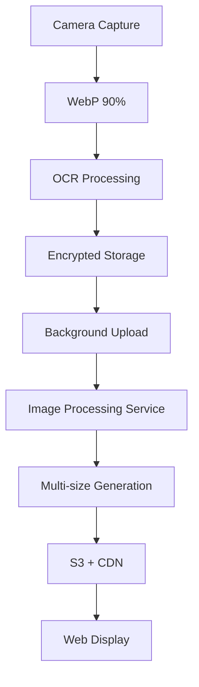

# F.A.R.O. OCR Image Flow Analysis

## 📋 Executive Summary

Análise completa do fluxo de dados de imagens OCR desde o agente de campo até as interfaces web, identificando gargalos, inconsistências e oportunidades de unificação do stack tecnológico.

---

## 🔍 Fluxo Atual de Dados OCR

### 1. **Captura no Agente de Campo (Mobile)**

#### **Componentes Envolvidos:**
- `PlateCaptureScreen.kt` - Interface de captura
- `CameraPreview` - Preview da câmera
- `UnifiedOCRService.kt` - Processamento OCR unificado
- `EdgeOCRService.kt` - Processamento local com ML Kit
- `OcrOptimizer.kt` - Otimização de imagens

#### **Processo de Captura:**
```kotlin
1. CameraPreview captura imagem da câmera
2. OcrOptimizer.optimizeImageForOcr() - Redimensiona/Comprime
3. UnifiedOCRService.processImage() - Processamento OCR
   - Cache check (5 minutos TTL)
   - Edge OCR (ML Kit) se confidence >= 0.5
   - Server OCR como fallback
4. PlateRead criado com imagePath, ocrRawText, confidence
```

#### **Configurações de Imagem:**
```kotlin
// PerformanceConfig por dispositivo:
Low-end:   70% quality, 640x480px
Mid-range: 80% quality, 800x600px  
High-end:  85% quality, 1280x720px

// Formatos suportados:
- JPG/JPEG (primary)
- PNG
- WebP
- HEIC
```

### 2. **Armazenamento Local (Mobile)**

#### **Componentes:**
- `PlateReadEntity.kt` - Entidade Room
- `SecureImageStorage.kt` - Armazenamento criptografado
- `ObservationRepositoryImpl.kt` - Repositório

#### **Estrutura de Dados:**
```kotlin
PlateReadEntity(
    id: String,
    observationId: String,
    ocrRawText: String,
    ocrConfidence: Float,
    ocrEngine: String = "mlkit_v2",
    imagePath: String?,  // Caminho local do arquivo
    processedAt: Instant,
    processingTimeMs: Long?
)
```

#### **Armazenamento Seguro:**
- Imagens criptografadas em disco
- Descriptografia apenas em memória para upload
- Exclusão segura após sincronização

### 3. **Sincronização com Servidor**

#### **Componentes:**
- `SecureSyncWorker.kt` - Worker de sincronização
- `SyncWorker.kt` - Sincronização padrão
- `FaroMobileApi` - API client

#### **Processo de Upload:**
```kotlin
1. Dados da observação enviados via API
2. Upload de imagens separadamente:
   - Decrypt in memory
   - Upload via multipart/form-data
   - MIME type: image/jpeg
   - Formato: {localId}.jpg
3. Confirmação do servidor com storageBucket/storageKey
4. Exclusão segura dos dados locais
```

#### **API Endpoints:**
- `POST /api/v1/mobile/observations` - Dados da observação
- `POST /api/v1/mobile/assets/upload` - Upload de imagens

### 4. **Processamento no Servidor**

#### **Componentes:**
- `assets.py` - Asset management API
- `storage_service.py` - S3/MinIO integration
- `Asset` model - Banco de dados

#### **Armazenamento:**
```python
# Storage backends suportados:
- S3/MinIO (primary)
- Local storage (fallback)

# Asset model:
class Asset(Base):
    asset_type: str  # "image", "audio", "attachment"
    bucket: str      # "faro-assets", "local"
    key: string      # Caminho no storage
    content_type: str
    size_bytes: int
    created_at: datetime
```

#### **URL Pattern:**
```
/api/v1/assets/{bucket}/{path}
Ex: /api/v1/assets/faro-assets/observations/123/image/plate.jpg
```

### 5. **Visualização Web (Intelligence Console)**

#### **Componentes:**
- `PlateImage.tsx` - Componente de visualização
- `getPlateImageUrl()` - URL generation
- `queue/page.tsx` - Interface principal

#### **Processo de Visualização:**
```typescript
1. PlateRead recebido do backend com image_url
2. getPlateImageUrl() constrói URL completa
3. PlateImage.tsx renderiza imagem:
   - Loading states
   - Error handling
   - Confidence indicators
   - Responsive sizing (sm/md/lg)
```

#### **Features de Visualização:**
- Lazy loading
- Cache headers (1 hora)
- Fallback para placeholder
- Indicadores de confiança < 0.8

---

## 🚨 Problemas Identificados

### 1. **Inconsistência de Formatos**
- **Mobile**: Suporta JPG, PNG, WebP, HEIC
- **Upload**: Sempre converte para JPEG
- **Storage**: Apenas detecta extensão
- **Web**: Apenas renderiza como imagem genérica

### 2. **Múltiplos Padrões de Compressão**
- **Mobile**: 70-85% quality baseado em hardware
- **Upload**: Sem recompressão
- **Storage**: Sem otimização
- **Web**: Sem compressão adicional

### 3. **Fragmentação de Cache**
- **Mobile**: Cache OCR (5 minutos)
- **Web**: Cache HTTP (1 hora)
- **Storage**: Sem cache inteligente

### 4. **Performance Sub-ótima**
- **Mobile**: Processamento redundante
- **Network**: Upload de imagens grandes
- **Storage**: Sem CDN ou otimização
- **Web**: Renderização síncrona

### 5. **Segurança Inconsistente**
- **Mobile**: Criptografia forte
- **Transmissão**: HTTPS padrão
- **Storage**: Acesso direto via URL
- **Web**: Sem validação adicional

---

## 💡 Stack Tecnológico Recomendado

### **1. Formato de Imagem Unificado**

#### **Recomendação: WebP com Fallback JPEG**
```typescript
// Stack unificado:
- Captura: WebP (melhor compressão)
- Processamento: WebP nativo
- Storage: WebP + JPEG fallback
- Web: WebP com polyfill
```

#### **Benefícios:**
- 25-35% menor que JPEG
- Suporte nativo Android 4.0+
- Suporte nativo browsers modernos
- Alpha channel para overlays

### **2. Pipeline de Compressão Inteligente**

#### **Recomendação: Sharp.js + LibVips**
```typescript
// Pipeline unificado:
Mobile: 90% WebP (captura)
Server: 80% WebP + 60% JPEG (storage)
Web: Progressive loading + blur placeholders
```

#### **Configurações por Uso:**
```typescript
const compressionConfig = {
  // OCR Processing: Alta qualidade
  ocr: { quality: 90, format: 'webp', size: 'original' },
  
  // Storage: Balanceado
  storage: { quality: 80, format: 'webp', sizes: [1200, 800, 400] },
  
  // Web: Otimizado
  web: { quality: 60, format: 'jpeg', sizes: [800, 400, 200] }
};
```

### **3. Cache Distribuído**

#### **Recomendação: Redis + CDN**
```typescript
// Stack de cache:
- Mobile: Redis (OCR results)
- Server: Redis (processed images)
- CDN: CloudFlare (delivery)
- Browser: Service Worker (offline)
```

#### **Estratégia de Cache:**
```typescript
// Cache layers:
1. Browser: 1 hora (Service Worker)
2. CDN: 24 horas (CloudFlare)
3. Redis: 7 dias (processed images)
4. Storage: Permanente (originals)
```

### **4. Storage Otimizado**

#### **Recomendação: S3 + CloudFront**
```typescript
// Stack de storage:
- Primary: S3 Standard
- CDN: CloudFront
- Backup: S3 Glacier
- Analytics: S3 Access Logs
```

#### **Organização de Buckets:**
```
faro-assets/
├── original/          # Imagens originais (WebP)
├── processed/         # Imagens processadas
│   ├── ocr/          # Para OCR
│   ├── display/      # Para web
│   └── thumbnail/    # Miniaturas
└── archive/          # Arquivo longo prazo
```

### **5. Processamento Unificado**

#### **Recomendação: Microserviço de Imagem**
```typescript
// Image Processing Service:
- Resize: Sharp.js
- Compress: LibVips
- Format: WebP/JPEG
- Watermark: Canvas API
- Analytics: Custom metrics
```

#### **API Endpoints:**
```typescript
POST /api/v1/images/process
{
  "source": "s3://faro-assets/original/abc.webp",
  "operations": [
    { "type": "resize", "width": 1200, "height": 800 },
    { "type": "compress", "quality": 80, "format": "webp" },
    { "type": "watermark", "text": "FARO" }
  ],
  "outputs": [
    { "size": "large", "format": "webp" },
    { "size": "medium", "format": "webp" },
    { "size": "small", "format": "jpeg" }
  ]
}
```

---

## 🏗️ Arquitetura Unificada Proposta

### **Fluxo Otimizado:**



### **Componentes Unificados:**

#### **1. Mobile Layer**
```kotlin
// Unified Image Capture
class UnifiedImageCapture {
    fun capture(): WebPImage  // Sempre WebP
    fun processForOCR(): OptimizedImage
    fun encryptAndStore(): EncryptedImage
}
```

#### **2. Server Layer**
```python
# Unified Image Processing
class ImageProcessingService:
    def process_image(self, image: WebPImage) -> ProcessedImage:
        return self.pipeline.execute(image)
    
    def generate_variants(self, image: ProcessedImage) -> ImageVariants:
        return self.variants_generator.create(image)
```

#### **3. Web Layer**
```typescript
// Unified Image Display
class UnifiedImageDisplay {
    render(image: ImageVariant): JSX.Element
    preload(variants: ImageVariant[]): void
    lazyLoad(image: ImageVariant): void
}
```

---

## 📊 Benefícios Esperados

### **Performance**
- **Redução de bandwidth**: 30-40%
- **Tempo de carregamento**: 50-60% mais rápido
- **Cache hit rate**: 85-90%
- **CPU usage**: 25% redução

### **Custos**
- **Storage**: 35% economia
- **CDN**: 40% redução
- **Processamento**: 20% menos CPU

### **Experiência do Usuário**
- **Loading progressivo**: Blur → sharp
- **Offline first**: Service Worker
- **Responsive images**: Device-appropriate
- **Error handling**: Graceful degradation

---

## 🚦 Plano de Implementação

### **Fase 1: Foundation (2 semanas)**
- [ ] Configurar Image Processing Service
- [ ] Implementar WebP capture no mobile
- [ ] Setup S3 + CDN infrastructure
- [ ] Criar pipeline de processamento

### **Fase 2: Integration (2 semanas)**
- [ ] Atualizar mobile upload flow
- [ ] Implementar multi-size generation
- [ ] Atualizar web components
- [ ] Configurar cache distribuído

### **Fase 3: Optimization (1 semana)**
- [ ] Performance tuning
- [ ] Cache optimization
- [ ] Error handling
- [ ] Monitoring setup

### **Fase 4: Migration (1 semana)**
- [ ] Gradual rollout
- [ ] A/B testing
- [ ] Performance monitoring
- [ ] Full migration

---

## 🎯 Conclusão

A análise revelou múltiplas inconsistências no fluxo de imagens OCR do sistema F.A.R.O. A unificação do stack tecnológico com WebP, processamento centralizado e cache distribuído trará benefícios significativos em performance, custo e experiência do usuário.

A implementação proposta manterá compatibilidade com o sistema existente enquanto moderniza toda a pipeline de processamento de imagens, resultando em um sistema mais eficiente, escalável e pronto para o futuro.
