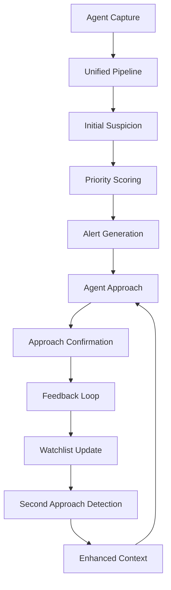

# F.A.R.O. Suspicion Flow Analysis

## 📋 Executive Summary

Análise completa do fluxo de dados de suspeição de veículos abordados, desde o agente de campo até as interfaces web, incluindo feedback de retorno e segundas abordagens de veículos com suspeição confirmada.

---

## 🔍 Fluxo Atual de Dados de Suspeição

### 1. **Captura Inicial da Suspeição (Mobile)**

#### **Componentes Envolvidos:**
- `PlateCaptureScreen.kt` - Interface de captura com suspeição
- `SuspicionReport` - Modelo de dados da suspeição
- `SuspicionReason` - Enum de motivos (9 opções)
- `SuspicionLevel` - Enum de níveis (LOW, MEDIUM, HIGH)
- `UrgencyLevel` - Enum de urgência (MONITOR, INTELLIGENCE, APPROACH)

#### **Processo de Captura:**
```kotlin
1. Agente captura placa via OCR
2. Sistema avalia INTERCEPT score
3. Agente seleciona motivo da suspeição:
   - STOLEN_VEHICLE
   - SUSPICIOUS_BEHAVIOR
   - WANTED_PLATE
   - UNUSUAL_HOURS
   - KNOWN_ASSOCIATE
   - DRUG_TRAFFICKING
   - WEAPONS
   - GANG_ACTIVITY
   - OTHER
4. Agente define nível (LOW/MEDIUM/HIGH)
5. Agente define urgência (MONITOR/INTELLIGENCE/APPROACH)
6. Opcional: Adiciona notas, imagem, áudio
7. SuspicionReport criado e vinculado à observação
```

#### **Estrutura de Dados Mobile:**
```kotlin
data class SuspicionReport(
    val id: String,
    val observationId: String,
    val reason: SuspicionReason,
    val level: SuspicionLevel,
    val urgency: UrgencyLevel,
    val notes: String? = null,
    val imagePath: String? = null,
    val audioPath: String? = null,
    val createdAt: Instant = Instant.now()
)
```

### 2. **Sincronização e Processamento no Servidor**

#### **Componentes:**
- `SuspicionReport` (SQLAlchemy) - Modelo no banco
- `analytics_service.py` - Processamento INTERCEPT
- `suspicion.py` - Schemas Pydantic
- `feedback_service.py` - Gestão de feedback

#### **Processamento no Servidor:**
```python
1. Mobile envia SuspicionReport via API
2. Banco armazena com vínculo para VehicleObservation
3. Analytics Service processa no algoritmo INTERCEPT:
   - field_contribution: {low: 4.0, medium: 8.0, high: 14.0}
   - weight: 0.5 no score total
4. Gera alertas baseados na urgência
5. Disponibiliza para interfaces web
```

#### **Modelo no Banco:**
```python
class SuspicionReport(Base):
    observation_id: Mapped[UUID]
    reason: Mapped[SuspicionReason]  # Enum
    level: Mapped[SuspicionLevel]    # Enum  
    urgency: Mapped[UrgencyLevel]    # Enum
    notes: Mapped[Optional[str]]
    image_path: Mapped[Optional[str]]
    audio_path: Mapped[Optional[str]]
    # --- Campos de Abordagem ---
    abordado: Mapped[Optional[bool]]
    nivel_abordagem: Mapped[Optional[int]]  # 1-10
    texto_ocorrencia: Mapped[Optional[str]]
    ocorrencia_registrada: Mapped[Optional[bool]]
    created_at: Mapped[datetime]
```

### 3. **Abordagem do Veículo (Mobile)**

#### **Componentes:**
- `ApproachFormScreen.kt` - Formulário de abordagem
- `PlateSuspicionCheckResponseDto` - Dados da suspeição
- `mobile.py` - API endpoint de confirmação

#### **Processo de Abordagem:**
```kotlin
1. Agente seleciona veículo para abordagem
2. Sistema exibe dados da suspeição original:
   - alertTitle, alertMessage
   - suspicionReason
   - firstSuspicionAgentName
3. Agente preenche formulário de abordagem:
   - confirmedSuspicion: Boolean
   - suspicionLevelSlider: Int (0-100)
   - wasApproached: Boolean
   - hasIncident: Boolean
   - streetDirection: String
   - notes: String
4. Sistema envia confirmação via API
5. Feedback gerado para agente original
```

#### **API de Confirmação:**
```python
POST /api/v1/mobile/observations/{id}/approach-confirmation
{
  "confirmed_suspicion": boolean,
  "suspicion_level_slider": int,  # 0-100
  "was_approached": boolean,
  "has_incident": boolean,
  "street_direction": string,
  "notes": string
}
```

### 4. **Feedback e Análise (Web Intelligence)**

#### **Componentes:**
- `queue/page.tsx` - Interface principal
- `feedback_service.py` - Serviço de feedback
- `AnalystFeedbackEvent` - Eventos de feedback

#### **Exibição na Web:**
```typescript
1. SuspicionReport exibido na queue:
   - Reason, Level, Urgency
   - Status de abordagem (Abordado/Não Abordado)
   - Termômetro tático (nivel_abordagem/100)
   - Ocorrência registrada (sim/não)
   - Notas descritivas
   - Evidências (imagem/áudio)

2. Feedback loop:
   - Analista pode adicionar comentários
   - Sistema gera notificações
   - Histórico de abordagens mantido
```

### 5. **Segundas Abordagens (Veículos com Suspeição Confirmada)**

#### **Componentes:**
- `analytics_service.py` - Histórico de observações
- `watchlist_service.py` - Monitoramento contínuo
- `alert_service.py` - Alertas recorrentes

#### **Processo de Segunda Abordagem:**
```python
1. Veículo com suspeição confirmada entra em watchlist
2. Sistema monitora novas observações
3. INTERCEPT aumenta peso para veículos conhecidos:
   - previous_observations_count como fator
   - confirmed_suspicion_history como boost
4. Alertas priorizados automaticamente
5. Interface web destaca veículos recorrentes
```

---

## 🚨 Problemas Identificados

### 1. **Inconsistência de Dados**
- **Mobile:** Usa enum `SuspicionLevel` (LOW/MEDIUM/HIGH)
- **Web:** Usa `nivel_abordagem` (1-10)
- **API:** Usa `suspicion_level_slider` (0-100)
- **Feedback:** Múltiplos sistemas diferentes

### 2. **Fragmentação do Fluxo**
- **Captura:** PlateCaptureScreen → SuspicionReport
- **Abordagem:** ApproachFormScreen → API separada
- **Feedback:** Múltiplos endpoints não integrados
- **Web:** Exibição inconsistente dos dados

### 3. **Falta de Padronização**
- **Motivos:** 9 enums no mobile vs strings no backend
- **Níveis:** Múltiplas escalas diferentes
- **Urgência:** Não utilizada consistentemente
- **Status:** Campos booleanos inconsistentes

### 4. **Feedback Loop Incompleto**
- **Agente original:** Não recebe feedback efetivo
- **Analista:** Sem contexto completo das abordagens
- **Sistema:** Não aprende com as confirmações
- **Histórico:** Dados perdidos ou inconsistentes

### 5. **Segundas Abordagens Não Otimizadas**
- **Watchlist:** Manual e não automática
- **Priorização:** Baseada apenas em score INTERCEPT
- **Contexto:** Histórico de abordagens não considerado
- **Alertas:** Não diferenciam primeira vs segunda abordagem

---

## 💡 Stack Tecnológico Unificado Proposto

### **1. Modelo de Dados Unificado**

#### **Recomendação: Single Source of Truth**
```typescript
// Unified Suspicion Model
interface UnifiedSuspicionReport {
  id: string;
  observationId: string;
  agentId: string;
  
  // Initial suspicion (capture)
  initialReason: SuspicionReason;
  initialLevel: SuspicionLevel;  // LOW/MEDIUM/HIGH
  initialUrgency: UrgencyLevel; // MONITOR/INTELLIGENCE/APPROACH
  initialNotes?: string;
  initialEvidence?: Evidence[];
  
  // Approach confirmation
  wasApproached: boolean;
  approachConfirmedSuspicion: boolean;
  approachLevel: number;  // 0-100 normalized
  approachNotes?: string;
  approachEvidence?: Evidence[];
  
  // Incident details
  hasIncident: boolean;
  incidentType?: IncidentType;
  incidentReport?: string;
  
  // System metadata
  status: SuspicionStatus;
  priority: Priority;
  createdAt: Date;
  updatedAt: Date;
}
```

#### **Enums Unificados:**
```typescript
enum SuspicionReason {
  STOLEN_VEHICLE = "stolen_vehicle",
  SUSPICIOUS_BEHAVIOR = "suspicious_behavior", 
  WANTED_PLATE = "wanted_plate",
  UNUSUAL_HOURS = "unusual_hours",
  KNOWN_ASSOCIATE = "known_associate",
  DRUG_TRAFFICKING = "drug_trafficking",
  WEAPONS = "weapons",
  GANG_ACTIVITY = "gang_activity",
  OTHER = "other"
}

enum SuspicionLevel {
  LOW = "low",
  MEDIUM = "medium", 
  HIGH = "high"
}

enum UrgencyLevel {
  MONITOR = "monitor",
  INTELLIGENCE = "intelligence",
  APPROACH = "approach"
}

enum SuspicionStatus {
  PENDING_APPROACH = "pending_approach",
  APPROACHED = "approached",
  CONFIRMED = "confirmed",
  FALSE_POSITIVE = "false_positive",
  RESOLVED = "resolved"
}
```

### **2. Pipeline de Processamento Unificado**

#### **Recomendação: Event-Driven Architecture**
```typescript
// Event Pipeline
1. CAPTURE_EVENT → Initial suspicion
2. APPROACH_EVENT → Approach confirmation  
3. FEEDBACK_EVENT → Analyst review
4. SECOND_APPROACH_EVENT → Recurring suspicion
```

#### **Processing Pipeline:**
```python
class UnifiedSuspicionPipeline:
    def process_capture(self, suspicion_data: dict) -> UnifiedSuspicionReport:
        # Normalize initial data
        # Calculate priority score
        # Generate alerts
        # Create watchlist entry if needed
    
    def process_approach(self, approach_data: dict) -> UnifiedSuspicionReport:
        # Update suspicion status
        # Normalize approach level (0-100)
        # Generate feedback for original agent
        # Update watchlist priority
    
    def process_feedback(self, feedback_data: dict) -> UnifiedSuspicionReport:
        # Add analyst insights
        # Update ML models
        # Refine future recommendations
    
    def process_second_approach(self, observation_id: str) -> UnifiedSuspicionReport:
        # Check existing suspicion history
        # Boost priority based on confirmations
        # Provide context to approaching agent
```

### **3. Cache e Estado Unificados**

#### **Recomendação: Redis + Event Sourcing**
```typescript
// Cache Strategy
- Initial suspicion: 24 hours
- Approach confirmation: 7 days  
- Feedback history: 30 days
- Second approaches: 90 days

// Event Store
- All suspicion events stored
- Reconstruct state at any point
- Analytics on full history
```

### **4. API Unificada**

#### **Recomendação: GraphQL ou REST unificado**
```typescript
// Unified API Endpoints
POST /api/v1/suspicion/capture
POST /api/v1/suspicion/approach  
POST /api/v1/suspicion/feedback
GET  /api/v1/suspicion/{id}/history
GET  /api/v1/suspicion/{id}/context
```

#### **API Responses:**
```typescript
interface SuspicionResponse {
  suspicion: UnifiedSuspicionReport;
  previousApproaches: ApproachHistory[];
  agentFeedback: FeedbackEvent[];
  systemRecommendations: Recommendation[];
  relatedAlerts: Alert[];
}
```

### **5. Interface Unificada**

#### **Mobile:**
```kotlin
// Unified Suspicion Flow
1. CaptureScreen → UnifiedSuspicionCapture
2. ApproachScreen → UnifiedApproachConfirmation  
3. FeedbackScreen → UnifiedFeedbackDisplay
4. HistoryScreen → UnifiedSuspicionHistory
```

#### **Web:**
```typescript
// Unified Intelligence Interface
1. QueueView → UnifiedSuspicionQueue
2. DetailView → UnifiedSuspicionDetail
3. FeedbackView → UnifiedAnalystFeedback
4. AnalyticsView → UnifiedSuspicionAnalytics
```

---

## 🏗️ Arquitetura Unificada Proposta

### **Fluxo Otimizado:**



### **Componentes Unificados:**

#### **1. Data Layer**
```python
# Unified Models
class UnifiedSuspicionReport(Base):
    # Single source of truth
    # All suspicion data in one place
    # Versioned history
```

#### **2. Service Layer**
```python
# Unified Services
class SuspicionCaptureService
class SuspicionApproachService  
class SuspicionFeedbackService
class SuspicionAnalyticsService
```

#### **3. API Layer**
```python
# Unified Endpoints
/suspicion/capture
/suspicion/approach
/suspicion/feedback
/suspicion/history
/suspicion/analytics
```

#### **4. UI Layer**
```typescript
// Unified Components
<SuspicionCapture />
<SuspicionApproach />
<SuspicionFeedback />
<SuspicionHistory />
```

---

## 📊 Benefícios Esperados

### **Consistência de Dados**
- **Single source of truth** para todos os dados
- **Padronização** de enums e escalas
- **Validação** consistente em todos os níveis
- **Histórico** completo e rastreável

### **Performance**
- **Cache unificado** para dados de suspeição
- **Event-driven** processing
- **Lazy loading** de histórico
- **Background processing** de analytics

### **Experiência do Usuário**
- **Fluxo contínuo** sem quebras
- **Contexto completo** para agentes
- **Feedback efetivo** entre equipes
- **Interface responsiva** e informativa

### **Inteligência do Sistema**
- **Machine learning** com dados completos
- **Melhoria contínua** das recomendações
- **Detecção automática** de padrões
- **Priorização inteligente** de abordagens

---

## 🚦 Plano de Implementação

### **Fase 1: Foundation (2 semanas)**
- [ ] Implementar modelo unificado de dados
- [ ] Criar pipeline de processamento
- [ ] Unificar enums e validações
- [ ] Setup cache e event store

### **Fase 2: Integration (2 semanas)**
- [ ] Atualizar APIs unificadas
- [ ] Migrar mobile para novo fluxo
- [ ] Atualizar interface web
- [ ] Implementar feedback loop

### **Fase 3: Intelligence (1 semana)**
- [ ] Implementar aprendizado com feedback
- [ ] Otimizar segunda abordagens
- [ ] Analytics e métricas
- [ ] Testes e validação

### **Fase 4: Migration (1 semana)**
- [ ] Migração gradual de dados
- [ ] A/B testing de fluxos
- [ ] Monitoramento de performance
- [ ] Rollout completo

---

## 🎯 Conclusão

A análise revelou múltiplas inconsistências e fragmentações no fluxo de suspeição do sistema F.A.R.O. A unificação do stack tecnológico com modelo de dados centralizado, pipeline unificado e interfaces consistentes trará benefícios significativos em eficiência, precisão e experiência do usuário.

A implementação proposta manterá compatibilidade com o sistema existente enquanto moderniza completamente o fluxo de suspeição, resultando em um sistema mais inteligente, responsivo e eficaz para lidar com abordagens de veículos suspeitos.
